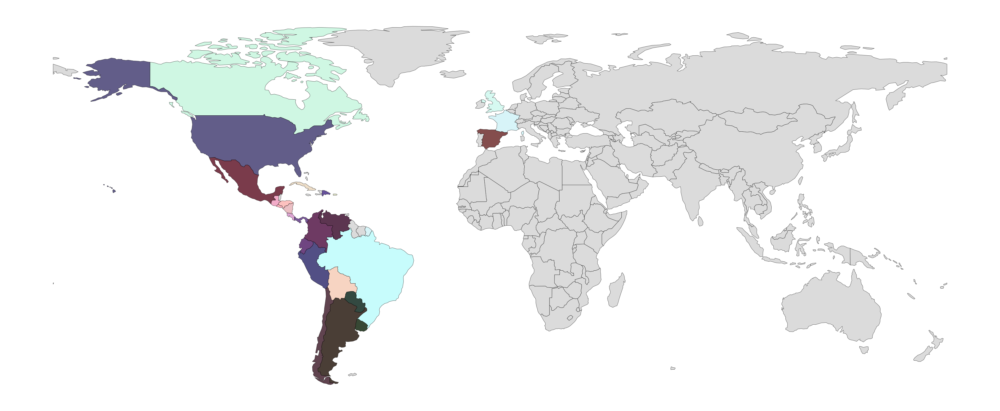
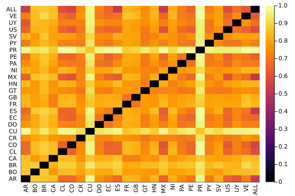
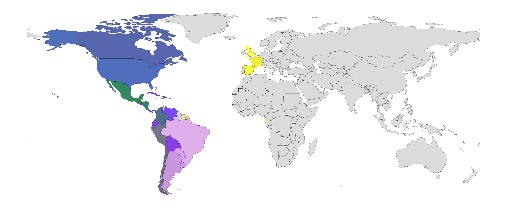
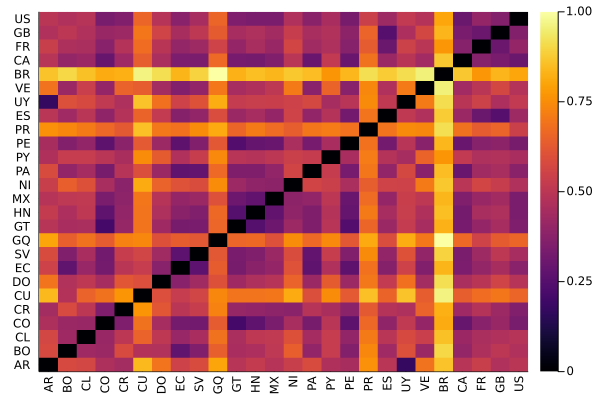

# Regionalized word embeddings for the Spanish-language

## Regional models
We created 26 word-embedding models with [https://fasttext.cc/](fastText), one per country. We learned 300 dimension vectors and use default hyper-parameters.

_A large scale lexical and semantic analysis of Spanish language variations in Twitter._ Eric S. Tellez, Daniela Moctezuma, Sabino Miranda, and Mario Graff. ARXIV URL.

# Semantic models

|    |    |    |    |    |
|----|----|----|----|----|
| [Argentina (AR)](http://geo.ingeotec.mx/~sadit/regional-spanish-models/AR.bin)   | [Bolivia (BO)](http://geo.ingeotec.mx/~sadit/regional-spanish-models/BO.bin)    | [Brazil (BR)](http://geo.ingeotec.mx/~sadit/regional-spanish-models/BR.bin)        | [Canadá (CA)](http://geo.ingeotec.mx/~sadit/regional-spanish-models/CA.bin)                   | [Chile (CL)](http://geo.ingeotec.mx/~sadit/regional-spanish-models/CL.bin)     |
| [Colombia (CO)](http://geo.ingeotec.mx/~sadit/regional-spanish-models/CO.bin)    | [Costa Rica (CR)](http://geo.ingeotec.mx/~sadit/regional-spanish-models/CR.bin) | [Cuba (CU)](http://geo.ingeotec.mx/~sadit/regional-spanish-models/CU.bin)          | [República Dominicana (DO)](http://geo.ingeotec.mx/~sadit/regional-spanish-models/DO.bin)     | [Ecuador (EC)](http://geo.ingeotec.mx/~sadit/regional-spanish-models/EC.bin)   |
| [España (ES)](http://geo.ingeotec.mx/~sadit/regional-spanish-models/ES.bin)      | [Francia (FR)](http://geo.ingeotec.mx/~sadit/regional-spanish-models/FR.bin)    | [Great Britain (GB)](http://geo.ingeotec.mx/~sadit/regional-spanish-models/GB.bin) | [Guinea Equatorial (GQ)](http://geo.ingeotec.mx/~sadit/regional-spanish-models/GQ.bin)        | [Guatemala (GT)](http://geo.ingeotec.mx/~sadit/regional-spanish-models/GT.bin) |
| [Honduras (HN)](http://geo.ingeotec.mx/~sadit/regional-spanish-models/HN.bin)    | [México (MX)](http://geo.ingeotec.mx/~sadit/regional-spanish-models/MX.bin)     | [Nicaragua (NI)](http://geo.ingeotec.mx/~sadit/regional-spanish-models/NI.bin)     | [Panamá (PA)](http://geo.ingeotec.mx/~sadit/regional-spanish-models/PA.bin)                   | [Perú (PE)](http://geo.ingeotec.mx/~sadit/regional-spanish-models/PE.bin)      |
| [Puerto Rico (PR)](http://geo.ingeotec.mx/~sadit/regional-spanish-models/PR.bin) | [Paraguay (PY)](http://geo.ingeotec.mx/~sadit/regional-spanish-models/PY.bin)   | [El Salvador (SV)](http://geo.ingeotec.mx/~sadit/regional-spanish-models/SV.bin)   | [United States of America (US)](http://geo.ingeotec.mx/~sadit/regional-spanish-models/US.bin) | [Uruguay (UY)](http://geo.ingeotec.mx/~sadit/regional-spanish-models/UY.bin)   |
| [Venezuela (VE)](http://geo.ingeotec.mx/~sadit/regional-spanish-models/VE.bin)   |                           |                              |                                         | **LARGE:**   [ALL](http://geo.ingeotec.mx/~sadit/regional-spanish-models/ALL.bin) | 

Our _ALL_ model is learned from the entire corpora. 

## Semantic affinity matrix

We used a subset of the [NRC EmoLex's](https://saifmohammad.com/WebPages/NRC-Emotion-Lexicon.htm) Spanish traslation to create an affinity matrix that captures the similarity between regions. The subset word-list (references) is the result of selecting those words labeled with at least some emotion and that become unique after our preprocessing step. 

Here you can find JSON files with the resources:

- [References word list](http://geo.ingeotec.mx/~sadit/regional-spanish-models/nrc-normalized-lexicon-with-emotions.json.gz)
- [Semantic affinity matrix](http://geo.ingeotec.mx/~sadit/regional-spanish-models/corpora-emo-affinity-matrix.json.gz)

# Lexical resources

The vocabularies of the Twitter Spanish Corpora, as described in the article, can be downloaded from the following JSON file: [26 vocabularies](http://geo.ingeotec.mx/~sadit/regional-spanish-models/vocabularies.json.gz)

Here you can find a JSON with the [Lexical affinity matrix](http://geo.ingeotec.mx/~sadit/regional-spanish-models/corpora-lex-affinity-matrix.json.gz). You can also find the frequencies of the [emojis](http://geo.ingeotec.mx/~sadit/regional-spanish-models/emojis-distribution.json.gz) around our regions of study.

## Corpora

| country            | code   | number of users | number of tweets | number of tokens |
|:----------         | ------ |          ------:|          -------:|        ---------:|
| Argentina          | AR | 1,376K | 234.22M | 2,887.92M |
| Bolivia            | BO | 36K    |  1.15M  |    20.99M |
| Chile              | CL | 415K   | 45.29M  |   719.24M |
| Colombia           | CO | 701K   | 61.54M  |   918.51M |
| Costa Rica         | CR | 79K    |  7.51M  |   101.67M |
| Cuba               | CU | 32K    |  0.37M  |     6.30M |
| Dominican Republic | DO | 112K   |  7.65M  |   122.06M |
| Ecuador            | EC | 207K   | 13.76M  |   226.03M |
| El Salvador        | SV | 49K    | 2.71M   |    44.46M |
| Equatorial Guinea  | GQ | 1K     | 8.93K   |     0.14M |
| Guatemala          | GT | 74K    | 5.22M   |    75.79M |
| Honduras           | HN | 35K    | 2.14M   |    31.26M |
| Mexico             | MX | 1,517K | 115.53M | 1,635.69M |
| Nicaragua          | NI | 35K    | 3.34M   |    42.47M |
| Panama             | PA | 83K    | 6.62M   |    108.74M|
| Paraguay           | PY | 106K   |  10.28M |   141.75M |
| Peru               | PE | 271K   | 15.38M  |   241.60M |
| Puerto Rico        | PR | 18K    | 0.58M   |     7.64M |
| Spain              | ES | 1,278K | 121.42M | 1,908.07M |
| Uruguay            | UY | 157K   | 30.83M  |   351.81M |
| Venezuela          | VE | 421K   | 35.48M  |   556.12M |
  | | | | |
 Brazil                   | BR | 1,604K |  27.20M |  142.22M |
 Canada                   | CA | 149K   |  1.55M  |  21.58M  |
 France                   | FR | 292K   |  2.43M  |  27.73M  |
 Great Britain            | GB | 380K   |  2.68M  |  34.62M  |
 United States of America | US | 2,652K | 40.83M  | 501.86M  |
 Total                    |    | 12M   |   795.74M |   10,876.25M |

## Preprocessing

We preprocessed messages as follows:

- lower casing
- diacritic marks removed
- grouped urls, urls, and numbers
- normalize symbol repetitions (max. 2 repeats)
- laughs were normalized to four letters
- words, punctuactions, and emojis are tokens

# Contact us

Please contact us if you want to know more about these resources:

- Eric S. Tellez - `eric.tellez@infotec.mx`
